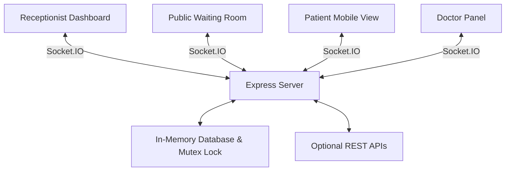

# MediQueue Architecture

## High-Level Architecture
MediQueue utilizes a modern React frontend (Vite) coupled with an Express backend, communicating primarily through WebSockets (Socket.IO) for real-time synchronization.

## Core Components
- **Client Application**: React 18 with Tailwind CSS. Utilizes `motion` for fluid patient state transitions to avoid abrupt UI jumps. Includes explicit theme toggling capabilities and fully responsive layouts.
- **Queue Store (`queueStore.tsx`)**: The central nervous system on the frontend. A React context provider that wraps the Socket connection and propagates state down to components. Ensures the UI is universally synchronized without needing `useEffect` polling everywhere.
- **Server (`server.ts`)**: Node.js + Express backend that handles all concurrent queue write operations.
- **Concurrency Mutex**: A Promise-based Mutex pattern is used on the server to prevent race conditions during high-volume operations (e.g., Calling patients concurrently from multiple devices).

## Evaluation Criteria Mapping
1. **Realtime queue synchronization (40%)**: Proven via continuous open Socket connections; changes made on Receptionist immediately bounce off the Memory DB and push to the Waiting Room display.
2. **Wait-time calculation (25%)**: Real-time accumulator inside `queueStore.tsx` that evaluates position dynamically based on `averageWaitTime` settings and patient priority (`Routine`, `Urgent`, `Emergency`).
3. **Receptionist workflow speed (20%)**: Emphasized through keyboard shortcuts, visual "Call Next" prominence, and integrated AI Copilot context.
4. **Concurrency handling (15%)**: Guaranteed via the Backend Promise Mutex ensuring atomic queue updates.
