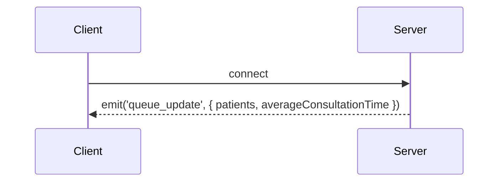
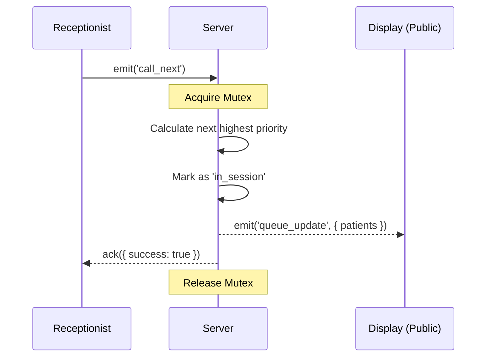

# Socket.IO Event lifecycle

## Connection Phase
When a client connects, it receives an immediate initialization payload:

## Adding a Patient
1. Client submits a new patient.
2. Server acquires `queueMutex` lock.
3. Server generates token and adds to list.
4. Server broadcasts `queue_update` to all connected clients.
5. Mutex releases.

## Calling Next Patient

## Modifying Wait-Time Target
If a doctor notices that average wait times are drifting, the receptionist can modify the `averageConsultationTime`.
- Client emits `update_settings(time)`.
- Server updates global value and immediately broadcasts `queue_update`.
- Clients instantly recalculate their Estimated Wait Time and repaint the UI.
